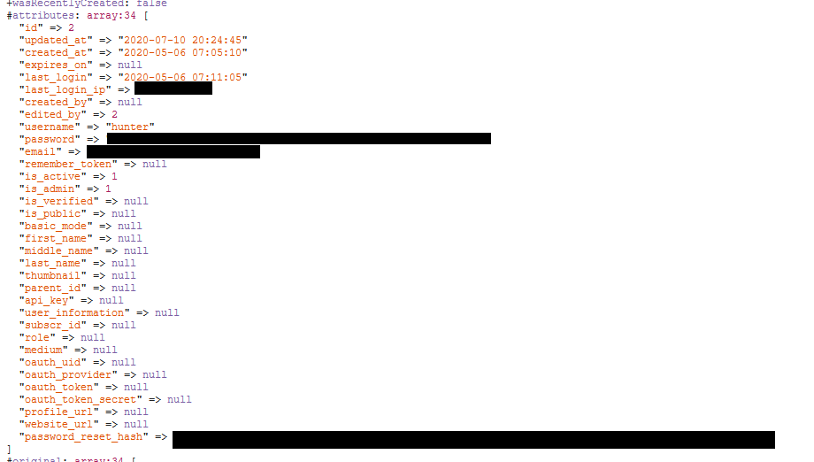

# CVE-2020-13405: MicroWeberUnauthenticated User Database Disclosure

## Information
**Description:** This thing allows this exploit in this software.  
**Versions Affected:** MicroWeber 1.1.19 And Below  
**Researcher:** Hunter Stanton (https://twitter.com/hun10sta)  
**Disclosure Link:** https://rhinosecuritylabs.com/research/microweber-database-disclosure/  
**NIST CVE Link:** https://nvd.nist.gov/vuln/detail/CVE-2020-13405  

## Proof-of-Concept Exploit
### Description
It is possible to run PHP scripts included with MicroWeber by submitting a POST request to the /module endpoint. One of these PHP scripts, */userfiles/modules/users/controller.php*, causes MicroWeber to print the contents of the users database. By submitting a POST request with *module=users/controller* in the body of the request, it is possible to obtain the contents of the users database as an unauthenticated user.  

### Usage/Exploitation
On a local webserver, host CVE-2020-13405.html and open it in a web browser. Then, enter the URL of the /module endpoint in the "MicroWeber Modules URL" field and click the "Attempt Exploit" button.  

### Screenshot
  